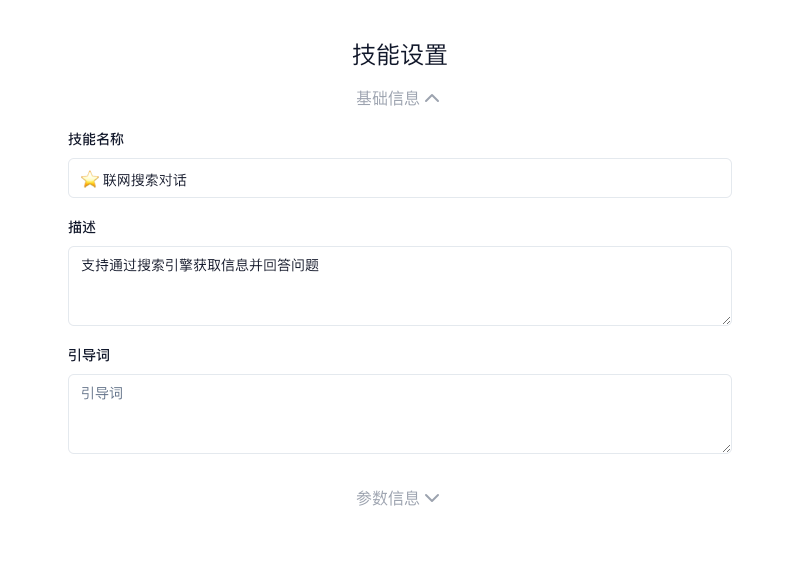
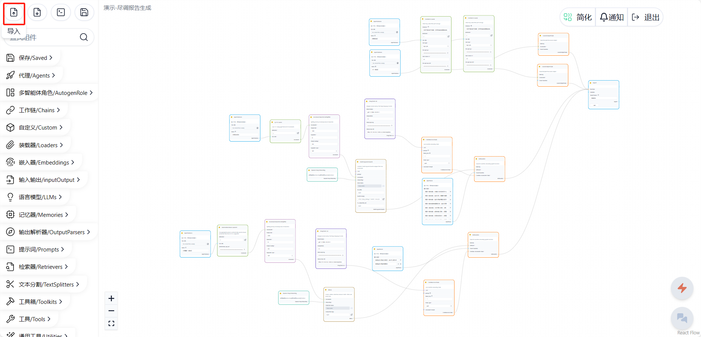
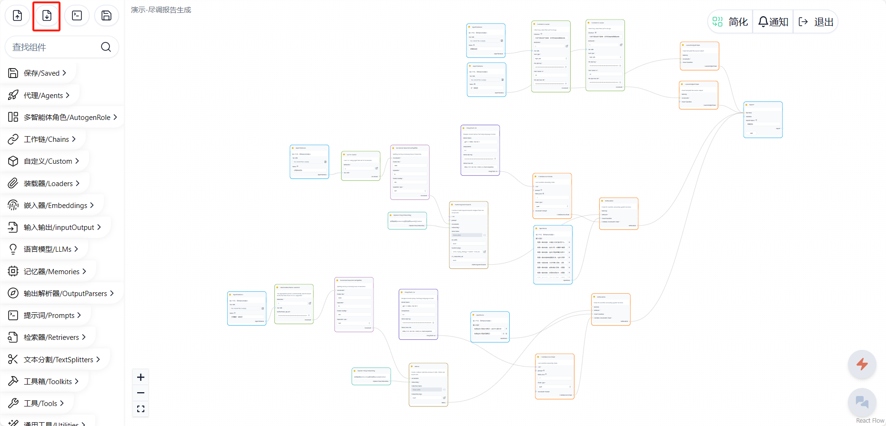
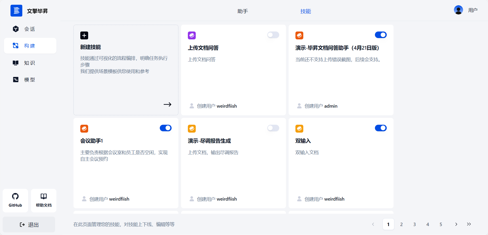
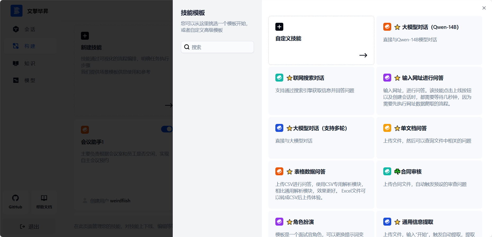

# 技能管理（技能构建指南）

我们文档介绍的组件会逐渐增加，暂时还没有涵盖的，可以参考 langchain 的文档，我们大部分组件都是基于 langchain 实现的：[https://python.langchain.com/docs/integrations/components](https://python.langchain.com/docs/integrations/components)

# 新建技能

在技能页右上角点击“新建”按钮，可以挑选技能模板或者自定义模板来构建技能。

- 技能名称：技能的名称。
- 描述：用来描述技能功能。
- 引导词：用户使用该技能新建会话时，会收到此引导词。引导词支持 Markdown 语法，最多 1000 字。

# 技能导入导出

在搭建技能时，如果需要借鉴之前搭建好的技能配置，可以使用导入功能，导入配置文件。配置文件一般是 json 格式。

在需要导入配置文件时，点击左上角导入键，便可导入

创建好技能后，可以点击左上角的导出键，就能导出 json 格式的配置文件。

# 技能列表

点击左侧栏的构建，再点击右上方的技能，便进入了技能列表，可以进行创建、编辑、删除等操作，也可以搜索相关技能

# 技能模板

技能模板是系统中自有的一些常用技能，能够实现一些简单又普遍应用的功能。在创建技能时可以直接套用技能模板，或者在技能模板的基础上进行修改。如图，在点击新建技能时，会默认显示一些技能模板。

